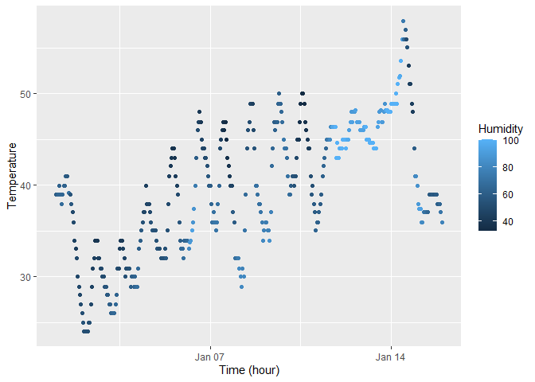

p8105_hw1_cd3591
================
Anny
2025-09-19

# Problem 1

``` r
# set up the packages needed
library("moderndive")
library("tidyverse")
```

    ## ── Attaching core tidyverse packages ──────────────────────── tidyverse 2.0.0 ──
    ## ✔ dplyr     1.1.4     ✔ readr     2.1.5
    ## ✔ forcats   1.0.0     ✔ stringr   1.5.1
    ## ✔ ggplot2   3.5.2     ✔ tibble    3.3.0
    ## ✔ lubridate 1.9.4     ✔ tidyr     1.3.1
    ## ✔ purrr     1.1.0     
    ## ── Conflicts ────────────────────────────────────────── tidyverse_conflicts() ──
    ## ✖ dplyr::filter() masks stats::filter()
    ## ✖ dplyr::lag()    masks stats::lag()
    ## ℹ Use the conflicted package (<http://conflicted.r-lib.org/>) to force all conflicts to become errors

``` r
# set up the dataset needed
data("early_january_weather")

# quick look for the variables in the dataset
early_january_weather
```

    ## # A tibble: 358 × 15
    ##    origin  year month   day  hour  temp  dewp humid wind_dir wind_speed
    ##    <chr>  <int> <int> <int> <int> <dbl> <dbl> <dbl>    <dbl>      <dbl>
    ##  1 EWR     2013     1     1     1  39.0  26.1  59.4      270      10.4 
    ##  2 EWR     2013     1     1     2  39.0  27.0  61.6      250       8.06
    ##  3 EWR     2013     1     1     3  39.0  28.0  64.4      240      11.5 
    ##  4 EWR     2013     1     1     4  39.9  28.0  62.2      250      12.7 
    ##  5 EWR     2013     1     1     5  39.0  28.0  64.4      260      12.7 
    ##  6 EWR     2013     1     1     6  37.9  28.0  67.2      240      11.5 
    ##  7 EWR     2013     1     1     7  39.0  28.0  64.4      240      15.0 
    ##  8 EWR     2013     1     1     8  39.9  28.0  62.2      250      10.4 
    ##  9 EWR     2013     1     1     9  39.9  28.0  62.2      260      15.0 
    ## 10 EWR     2013     1     1    10  41    28.0  59.6      260      13.8 
    ## # ℹ 348 more rows
    ## # ℹ 5 more variables: wind_gust <dbl>, precip <dbl>, pressure <dbl>,
    ## #   visib <dbl>, time_hour <dttm>

**Short Description** The early_january_weather dataset has 358 rows and
15 columns. Its variables contain: origin, year, month, day, hour, temp,
dewp, humid, wind_dir, wind_speed, wind_gust, precip, pressure, visib,
time_hour. In specific, times range from 2013-01-01 01:00:00 to
2013-01-15 23:00:00. The mean temperature over this time period is
39.5821229 °F.

``` r
# change the Chinese of X-axis into English
invisible(Sys.setlocale("LC_TIME", "English"))
```

``` r
# make a scatterplot of temp(y) vs time_hour(x)
temp_vs_time_plot = ggplot(early_january_weather,
                           aes(x = time_hour, y = temp, color = humid)) + 
  geom_point() +
  labs(x = "Time (hour)", y = "Temperature", color = "Humidity") 
temp_vs_time_plot
```

<!-- -->
Description: The scatterplot indicates that the temperatures show a
daily predictable cycle, which is cooler in early hours, and higher
later, and then cooler again in the evening. There is a rising trend of
temperatures with daily fluctuation over these two weeks, moving from
the low 30s°F up to 50s°F before a very short cool down. Humidity, as
seen in the blue color, describes that the darker the blue, the lower
the humidity; the lighter the blue, the higher the humidity. Generally,
the humidity is low over these two weeks, except for the time around Jan
7th and Jan 14th. Notably, humidity is extremely high around January 14.

``` r
# export the scatterplot
ggsave("temp_vs_time.png", plot = temp_vs_time_plot)
```

    ## Saving 7 x 5 in image

# Problem 2

``` r
set.seed(1122)

# build the data frame
x_numeric = rnorm(n = 10) # a random sample of size 10 from a standard normal distribution
x_logical = x_numeric > 0 # whether the elements of the sample are greater than 0
x_character = sample(letters, 10) # a character vector of length 10
x_factor = factor(sample(c("small", "medium", "large"), 10, replace = TRUE),
                  levels = c("small","medium","large")) # a factor vector of length 10, with 3 different levels

X = data.frame(normal = x_numeric,
               logit = x_logical,
               letters = x_character,
               levels = x_factor)

# quick look for the X data frame
X
```

    ##         normal logit letters levels
    ## 1  -1.42355175 FALSE       h medium
    ## 2   0.44996014  TRUE       e  small
    ## 3  -0.07041006 FALSE       k  large
    ## 4   1.96044818  TRUE       x medium
    ## 5  -0.55070418 FALSE       j medium
    ## 6   0.96695297  TRUE       r  small
    ## 7  -0.52464987 FALSE       i  small
    ## 8   0.98205021  TRUE       t  large
    ## 9   1.79954371  TRUE       v  large
    ## 10 -1.47411893 FALSE       a medium

``` r
# pull the numeric variable and calculate the mean
mean(X %>% pull(normal))
```

    ## [1] 0.211552

``` r
# pull the logical variable and calculate the mean
mean(X %>% pull(logit))
```

    ## [1] 0.5

``` r
# pull the character variable and calculate the mean
mean(X %>% pull(letters))
```

    ## Warning in mean.default(X %>% pull(letters)): argument is not numeric or
    ## logical: returning NA

    ## [1] NA

``` r
# pull the factor variable and calculate the mean
mean(X %>% pull(levels))
```

    ## Warning in mean.default(X %>% pull(levels)): argument is not numeric or
    ## logical: returning NA

    ## [1] NA

The numeric variable (normal) and the logical variable (logit) work.
This is because normal is already numeric, which is able to calculate
the mean, and the R interprets False = 0 and True = 1 in the logical
variable; therefore, the mean can also be calculated.

However, the character (letters) and factor (levels) variables do not
work: their means cannot be calculated because they are not numeric, and
such means would be meaningless.

``` r
# use as.numeric to the logical, character, and factor variables

as.numeric(X$logit) # the values are changed into numbers with False = 0 and True = 1
# R interprets False = 0 and True = 1
# this explains why mean(logit) works: this shows the proportion of TRUEs

as.numeric(X$letters) # warning: NAs introduced by coercion
# in R, non-numeric strings convert to NA
# Hence mean(letters) fails (there are no numeric values in the character variable)

as.numeric(X$levels) # the values are changed into numbers with small = 1, medium = 2, and large = 3
# in R, a factor is stored as an integer vector with a levels attribute
# calculating the mean of the factor variable typically meaningless, which is why mean(levels) is blocked by default.
```
